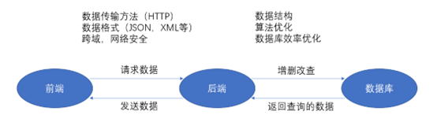
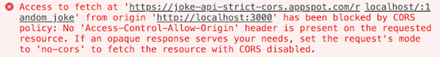

# 如何从零开始搭建自己的个人网站(3)——后端

## 简介

正如上一篇文章结尾处所提到的，后端技术是前端开发者比较陌生的领域，因而实现起来会比较棘手。在这篇文章中，我会大致地介绍一下后端分为那些部分，以及一个相当重要的点：前端与后端如何进行交互。不过首先，我还是简要地说明一下我认为的前端和后端的区别以及各自该做的事情。

## 前端和后端的区别与联系

顾名思义，前端负责一个应用程序靠“前”，即用户端可以直接看到的部分的设计和实现，包括页面编写，交互式设计，不同终端的适配等。后端则是负责靠“后”，即很多时候用户并不能直接看到的后台处理，如数据库交互，网络编程，算法优化这些。最最简单的来说，前端负责展示，后端负责底层处理。关于数据流向的问题，我自己画了下面这张图来进行简单的说明（我的天，当时还自己专门画图吗orz）：



这些肯定只是最最基本的东西，关于性能优化和网络安全的水太过深，我现在也不懂，只能以后了解之后再另出文章解释了。不过对于我们网站的第一版上线来说，这两样东西并不是那么的重要，掌握图中的这些我觉得已经足够了。

## Step-5：后端接口编写与前后交互

前端与后端需要通过HTTP来进行不同类型的数据交互，那么后端必须要提供一组URL来分别处理每一种数据请求，这些URL通常被程序员们称为“接口”或者“API”(Application Program Interface)。举个例子，比如我们网站的根目录在 http://www.example.com/，这时候如果我们需要创建一个新的博客，后端需要在某一个端口上开放一个子URL来供前端调用，如 http://www.example.com:9999/createBlog。开放接口之后，前端就可以使用JavaScript原生的fetch操作来获取数据（GET）或上传数据（POST）。从原理上讲，这样就可以完成前后交互，但是事情总是不会很容易就让我们搞定。如果你有尝试过上述的操作，你可能会在浏览器看到如下的一行报错信息：



翻译一下，这并不是你的接口或者fetch写得不对，而是因为你的fetch请求被一个叫CORS的神奇的东西给墙了。这个CORS全程叫 Cross-Origin Resource Sharing，即跨源资源共享。通俗一点，浏览器为了防止一些恶意软件随意访问接口从而盗取信息或者注入恶意脚本，直接禁用了任何跨IP地址，甚至同一个IP下跨端口的HTTP请求。好在，解决这个问题也不是没有办法。

## Step-6：解决跨域

这里我主要讲两个我亲测有效的方法。第一种是利用cors-anywhere路由，简单粗暴，但需要翻墙，不推荐。第二种则是为Gin写一个中间件，指定放行某一IP和端口的HTTP请求。第二种方法是我强烈推荐的，请大家一定尝试。

第一个比较粗暴，直接在fetch的url前面加上 https://cors-anywhere.herokuapp.com/ 。这个网站按我的理解是作为你的目标接口之间的中间路由，他会给你的HTTP请求添加 Access-Control-Allow-Origin 等头部（上图报错信息中提到），从而让CORS同意让你请求。具体信息见 GitHub/Rob--W/cors-anywhere 。我并不推荐大家使用这种方法，主要是因为这个中间路由需要“科学上网”，对大多数无法翻墙的用户机并不适用。

第二种是比较好的做法，即在后端编写接口的时候就放行所有的请求（最好是指定放行某一IP:端口发来的请求）。对于Golang和其接口框架Gin来说，就是编写一个中间件。

```golang
/* Gin解决跨域问题 */
func CORSMiddleware() gin.HandlerFunc {
    return func(c *gin.Context) {
    c.Writer.Header().Set("Access-Control-Allow-Origin", "*")
    c.Writer.Header().Set("Access-Control-Allow-Credentials", "true")
    c.Writer.Header().Set("Access-Control-Allow-Headers", "Content-Type, Content-Length, Accept-Encoding, X-CSRF-Token, Authorization, accept, origin, Cache-Control, X-Requested-With")
    c.Writer.Header().Set("Access-Control-Allow-Methods", "POST, OPTIONS, GET, PUT")

        if c.Request.Method == "OPTIONS" {
            // c.JSON(http.StatusOK, "Options Request!")
      c.AbortWithStatus(204)
               return
     }
    c.Next()
  }
}
```

然后在main函数开头就use这个中间件：

```golang
func main() {
     r := gin.Default()
     /* 调用Cors函数以解决跨域问题 */
     r.Use(CORSMiddleware())

     /* Your Interfaces */
}
```

如果代码看不清楚或者还不能work的话，请参见这个文章：https://stackoverflow.com/questions/29418478/go-gin-framework-cors 

## 结尾

这样操作下来的话，大概率你就能成功地进行前后端交互了。这里顺便推荐一个比较好用的接口调试软件——Postman，基本是家喻户晓的软件了就不多说。下一步就是后端如何与数据库进行交互了，这个并不是特别难，我留到下一篇文章再讲。